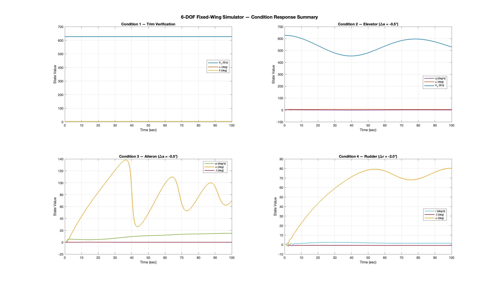
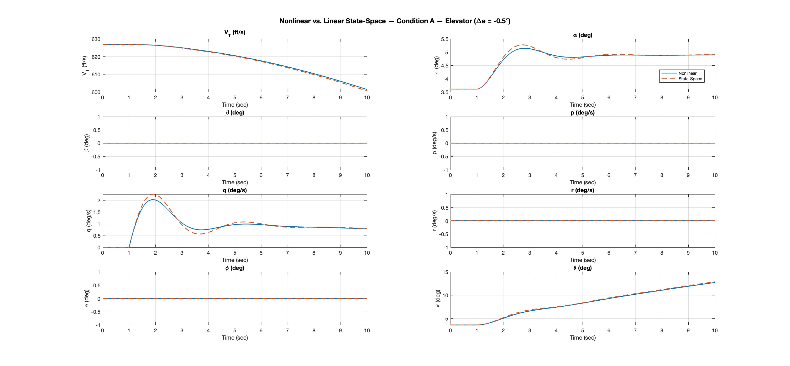
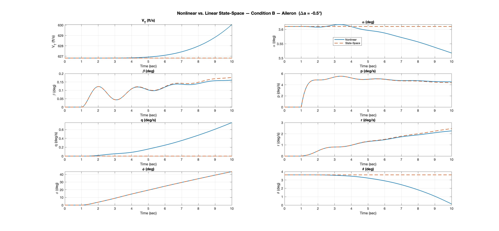
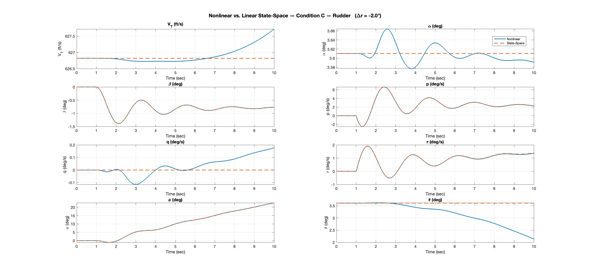

# Fixed-Wing 6-DOF Flight Dynamics Simulation Suite
> **Status: Complete.** This module is frozen. 
> Future extensions will be developed in a separate repository.

**Course:** MECE-410 — Flight Dynamics (Spring 2021). As of Spring 2025, the offered course code is now MECE 510 / 610 to reflect Graduate course rigor     
**Authors:** Bryan L., P.S., M.C. *(co-authors anonymized at their discretion)*  
**Toolchain:** MATLAB / Simulink

---

## Overview

This repository documents a two-part flight dynamics study built around a high-fidelity **Six-Degree-of-Freedom (6-DOF) nonlinear aircraft simulation**. The work follows a deliberate engineering progression:

**Part 01** constructs the nonlinear truth model and verifies it holds trim across four control perturbation scenarios.  
**Part 02** linearizes that same model at the trim point, extracts a state-space representation, and validates it against the truth model through overlay comparison plots.

Together, they form a complete stability audit pipeline — from raw physics to linearized approximation — that mirrors the V&V workflow used in professional GNC development.

---

## Repository Structure

```
nonlinear-6dof-truth-model/
│
├── README.md
│
├── 01_Nonlinear_TruthModel/
│   ├── FixedWingSim_Main.m               # Main script — 4-condition stability audit
│   ├── FixedWingSim_Parameters.m         # Aircraft & trim parameters (client input)
│   ├── FixedWingSim_SimulinkDiagram.slx  # 6-DOF nonlinear Simulink truth model
│   └── plot_condition_debug.m            # Debug utility — full 3x3 state dump
│
└── 02_Linearization_Audit/
    ├── FixedWing_Linear_Audit.m          # Main script — linmod extraction & V&V
    ├── FixedWingSim_Parameters.m         # Aircraft & trim parameters (client input)
    ├── FixedWing_Nonlinear_Audit.slx     # Nonlinear model (Cm_alphadot = 0)
    └── FixedWing_Linear_Sim.slx          # Linear state-space Simulink diagram
```

> **Note:** `FixedWingSim_Parameters.m` is shared across both parts. All scripts must be run from the repository root so the parameter file resolves correctly on the MATLAB path.

---

## Aircraft Specifications

Both parts operate on the same rigid-body airframe.

| Property | Value |
|---|---|
| Mass | 762.8447 slugs |
| I_xx | 8,890.63 slug·ft² |
| I_yy | 71,973.5 slug·ft² |
| I_zz | 77,141.1 slug·ft² |
| I_xz | 181.119 slug·ft² |
| Wing Area (S) | 300 ft² |
| Mean Chord (c̄) | 11.32 ft |
| Wingspan (b) | 30 ft |

**Trim Condition:** V_T = 626.819 ft/s | α = θ = 3.6103° | δe = −3.038° | Thrust = 3,146.48 lbs

---

## Part 01 — Nonlinear Truth Model

### What It Does

Simulates the full nonlinear aircraft dynamics using nine coupled differential equations. No linearization assumptions are made. The aerodynamic forces and moments are computed from a non-dimensional coefficient model and dimensionalized using dynamic pressure, wing geometry, and control surface states.

**State Vector:** `[V_T, α, q, β, p, r, φ, θ, ψ]ᵀ`  
**Control Vector:** `[δe, δa, δr]ᵀ`  
**Solver:** ode5, fixed step Δt = 0.01s

### Aero Engine Architecture

- **Coefficient Model:** C_L, C_D, C_y, C_l, C_m, C_n — each a function of α, α̇, β, and body rates (p, q, r)
- **Dimensionalization:** Forces and moments scaled by q̄ = 0.5ρV_T², S, c̄, and b
- **Inertia Coupling:** Full 3×3 inertia tensor inverted as K = I⁻¹ for angular acceleration propagation

### Stability Audit Conditions

| # | Condition | Stimulus at t = 1.0s | Primary Observable |
|---|---|---|---|
| 1 | Trim Verification | None | Flat-line V_T, α, θ — confirms equilibrium holds |
| 2 | Longitudinal Step | Δδe = −0.5° | Short Period (q, α) and Phugoid (V_T) excitation |
| 3 | Lateral Step | Δδa = −0.5° | Roll mode (p → φ) and adverse yaw coupling (β) |
| 4 | Directional Step | Δδr = −2.0° | Dutch Roll (r, β oscillation) and dihedral effect (φ) |

### Output

A single consolidated **2×2 summary figure** that shows one quadrant per condition, each showing only the states most diagnostic of that condition's dominant flight mode, is lsted below as Figure 1. 

*Figure 1: Consolidated 4-condition stability audit. Each quadrant highlights the 
diagnostic states for its dominant flight mode: trim hold, elevator (longitudinal), 
aileron (lateral), and rudder (directional) perturbations. Δt = 0.01s, ode5 solver.*

The `plot_condition_debug.m` utility provides a full **3×3 dump of all 9 states** for any condition when deeper inspection is needed. Run it from the command window after `FixedWingSim_Main.m` has executed:

```matlab
plot_condition_debug(sim_trim, 'Trim Verification')
plot_condition_debug(sim_elev, 'Elevator Perturbation')
plot_condition_debug(sim_ail,  'Aileron Perturbation')
plot_condition_debug(sim_rud,  'Rudder Perturbation')
```

---

## Part 02 — Linearization Audit

### What It Does

Extracts a linearized state-space model from the nonlinear truth model at the established trim point using MATLAB's `linmod()` command (numerical Jacobian). The global system is then decoupled into two physically meaningful subsystems, analyzed for modal stability, and validated against the truth model through overlay comparison plots.

**Constraint:** C_mα̇ = 0 during linearization (Cm_alphadot set to zero per project specification).

### Linearization Pipeline

```
Nonlinear Truth Model (at trim)
        │
        ▼
   linmod()  ──►  Global [A, B, C, D]  (8×8 system)
        │
        ▼
   Matrix Partitioning
        ├──► Longitudinal Sub-system  [V_T, α, q, θ]ᵀ  — input: δe
        └──► Lateral-Dir. Sub-system  [β, p, r, φ]ᵀ    — inputs: δa, δr
        │
        ▼
   Modal Analysis via damp()
        ├──► Longitudinal: Short Period (ζ, ωn), Phugoid (ζ, ωn)
        └──► Lateral-Dir.: Dutch Roll (ζ, ωn), Roll (τ), Spiral (τ)
        │
        ▼
   Transfer Functions via ss2tf()
        ├──► q(s) / δe(s)   — pitch rate response to elevator
        └──► α(s) / δe(s)   — angle-of-attack response to elevator
```

### Modal Analysis Summary

The `damp()` function is applied to each decoupled state-space object. The output identifies:

**Longitudinal modes** — Short Period (high-frequency, well-damped complex pair) and Phugoid (low-frequency, lightly-damped complex pair).

**Lateral-Directional modes** — Dutch Roll (lightly-damped complex pair driving β and r), Roll mode (fast real eigenvalue, characterizes p time constant), and Spiral mode (slow real eigenvalue, characterizes long-term φ behavior).


<details>
<summary><strong>Modal Analysis Results & Transfer Functions — Click to Expand</strong></summary>

### Longitudinal Modal Analysis

| Mode | Poles | Damping (ζ) | Natural Freq (rad/s) | Time Constant (s) |
|---|---|---|---|---|
| Phugoid | -5.72e-03 ± 6.85e-02i | 0.0831 | 0.0688 | 175 |
| Short Period | -6.42e-01 ± 1.81e+00i | 0.335 | 1.92 | 1.56 |

Both modes are **stable** (negative real parts). Phugoid is lightly damped (ζ = 0.083) — characteristic of long-period velocity/altitude exchange. Short Period is well-damped (ζ = 0.335) — characteristic of rapid pitch settling.

### Lateral-Directional Modal Analysis

| Mode | Poles | Damping (ζ) | Natural Freq (rad/s) | Time Constant (s) |
|---|---|---|---|---|
| Spiral | -2.57e-02 | 1.00 | 0.0257 | 39.0 |
| Dutch Roll | -4.08e-01 ± 2.75e+00i | 0.147 | 2.78 | 2.45 |
| Roll | -2.82e+00 | 1.00 | 2.82 | 0.354 |

All modes **stable**. Dutch Roll lightly damped (ζ = 0.147) — oscillatory β/r coupling. Roll mode fast (τ = 0.354s). Spiral mode slow (τ = 39.0s) — long-term bank angle behavior.

### Transfer Functions (Elevator Input)

**Pitch Rate Response — q(s) / δe(s)**

```
        -9.199s³ - 7.477s² - 0.08776s
  ─────────────────────────────────────────────
  s⁴ + 1.295s³ + 3.696s² + 0.04811s + 0.01739
```

**Angle-of-Attack Response — α(s) / δe(s)**

```
       -0.1289s³ - 9.213s² - 0.1215s - 0.04809
  ─────────────────────────────────────────────
  s⁴ + 1.295s³ + 3.696s² + 0.04811s + 0.01739
```

Shared denominator confirms both TFs derive from the same longitudinal characteristic equation. Roots of the denominator correspond directly to the Phugoid and Short Period poles above.

</details>

### Validation Conditions

The same three perturbations from Part 01 (excluding trim hold) are re-run with both models simultaneously. Nonlinear and linear outputs are overlaid on a shared time axis.

| Condition | Stimulus | Dominant Modes Visible |
|---|---|---|
| A — Elevator | Δδe = −0.5° | Short Period, Phugoid |
| B — Aileron | Δδa = −0.5° | Roll mode, Dutch Roll coupling |
| C — Rudder | Δδr = −2.0° | Dutch Roll, Spiral, Dihedral effect |

**Plot convention:** Solid line = nonlinear truth model. Dashed line = linear state-space approximation. Agreement confirms linearization validity; divergence marks the boundary of the small-perturbation assumption.

### Output

Three **4×2 overlay figures** — one per condition, all 8 states plotted, nonlinear vs. linear on each subplot. Modal analysis and transfer functions print to the MATLAB command window.


*Figure 2: Nonlinear truth model vs. linear state-space overlay — elevator step input (Δδe = −0.5° at t = 1.0s). All 8 states plotted across the decoupled 
longitudinal and lateral-directional subsystems. Agreement validates the linearization 
at trim; divergence marks the boundary of the small-perturbation assumption. 
Solid — nonlinear. Dashed — state-space approximation.*



*Figure 3: Nonlinear truth model vs. linear state-space overlay — aileron step 
input (Δδa = −0.5° at t = 1.0s). Primary response visible in roll rate (p) and 
bank angle (φ). Lateral-directional coupling via sideslip (β) validates the 
decoupled lateral sub-system accuracy against the full nonlinear model.
Solid — nonlinear. Dashed — state-space approximation.*



*Figure 4: Nonlinear truth model vs. linear state-space overlay — rudder step 
input (Δδr = −2.0° at t = 1.0s). Dutch Roll dynamics visible in yaw rate (r) and 
sideslip (β) oscillations. Dihedral effect captured in bank angle (φ) response. 
Largest perturbation magnitude of the three conditions — most likely to expose 
linearization breakdown.
Solid — nonlinear. Dashed — state-space approximation.*

---

## How to Run

### Part 01
```matlab
% From repository root in MATLAB:
run('01_Nonlinear_TruthModel/FixedWingSim_Main.m')
```

### Part 02
```matlab
% linmod must run before any perturbed simulations — handled automatically.
run('02_Linearization_Audit/FixedWing_Linear_Audit.m')
```

> Parts are independent but share `FixedWingSim_Parameters.m`. Part 02 is best read after Part 01 since it references the same trim point and perturbation magnitudes.

---

## Legacy Note

Originally developed as a course assessment for **MECE-410: Flight Dynamics** (Spring 2021). Refactored for portfolio presentation with improved code structure, consolidated figures, and technical documentation. The Simulink diagrams are treated as black-boxes; all MATLAB scripts are the primary deliverable.
