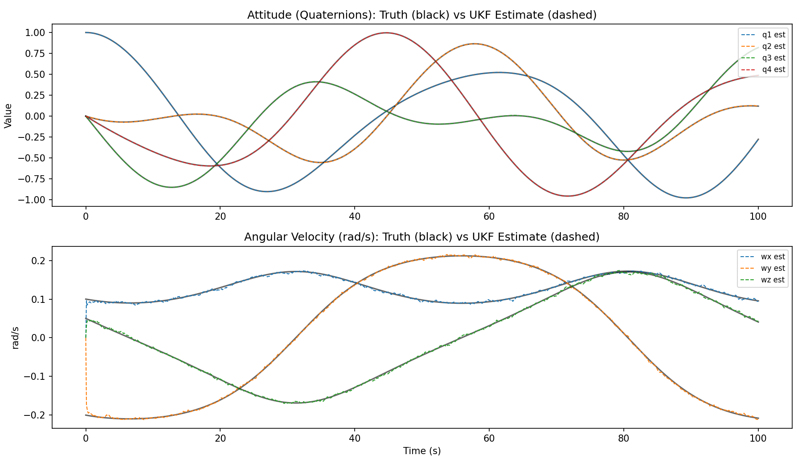
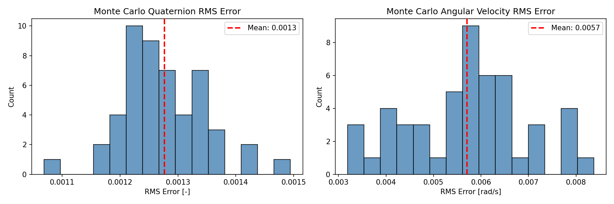

# Satellite Quaternion UKF Estimation

A 7-state Unscented Kalman Filter (UKF) for estimating the attitude and angular velocity of a passively tumbling satellite. Built in Python from a prior MATLAB implementation.

The filter fuses noisy star tracker (quaternion) and gyroscope (angular velocity) measurements to produce a cleaner state estimate than either sensor alone.

---

## Problem Setup

A rigid satellite is given an initial "tip-off" angular rate and left to tumble freely under Euler rotational dynamics — no control torques applied. Two sensors observe the state:

- **Star Tracker** — measures orientation as a quaternion, noise `σ = 0.005`
- **Gyroscope** — measures angular velocity (rad/s), noise `σ = 0.01 rad/s`

The UKF fuses both to estimate the full 7-state vector `[q1, q2, q3, q4, wx, wy, wz]`.

---

## Results

### Single Run — Truth vs. UKF Estimate



The UKF tracks the tumbling quaternions and angular rates closely across 100 seconds. The angular velocity plot shows the filter converging from its zero-knowledge initialization within the first ~10 seconds, after which the estimate locks onto the truth signal.

### Monte Carlo — 50 Randomized Tip-Off Rates



| Metric | Mean RMS Error |
|---|---|
| Quaternion attitude | 0.0013 |
| Angular velocity | 0.0057 rad/s |

Across 50 trials with randomized initial tumble rates (±0.3 rad/s per axis), the filter consistently outperforms the raw sensor noise floor — roughly 4× better than the star tracker and 2× better than the gyro.

---

## Project Structure

```
.
├── satellite_dynamics_step.py   # Quaternion kinematics + Euler rotational dynamics
├── satellite_generator.py       # Truth propagation + synthetic noisy measurements
├── satellite_ukf.py             # UKF core (predict/update) + Monte Carlo runner + plots
└── README.md
```

---

## Physics

**State vector:** `x = [q1, q2, q3, q4, wx, wy, wz]`

**Quaternion kinematics:**

```
dq/dt = 0.5 * Ω(ω) * q
```

**Euler rotational dynamics:**

```
J * dω/dt = M_ctrl - ω × (J * ω)
```

Integration uses a first-order Euler step with quaternion renormalization at every timestep.

---

## Running It

```bash
uv init
uv add numpy scipy matplotlib
uv run python satellite_ukf.py
```

Produces `ukf_single_run.png` and `ukf_monte_carlo.png` in the working directory.

---

## Dependencies

| Package | Purpose |
|---|---|
| `numpy` | Linear algebra, state propagation |
| `scipy` | `sqrtm` for numerically stable sigma point generation |
| `matplotlib` | Plotting |

---

## Future Work

**Direction 1 — Active Detumbling Control (ADCS)**

The natural next step is replacing `M_ctrl = zeros(3)` with a feedback controller (e.g., B-dot or PD) that drives angular rates to zero. The UKF estimate feeds directly into the controller, making this a closed-loop estimation + control problem — closer to what a real CubeSat ADCS board actually does.

**Direction 2 — Realistic Sensor Models**

Currently the measurement function is a direct state observer (`h(x) = x`). A more realistic model would have the star tracker return unit vectors or a rotation matrix rather than a quaternion directly, and the gyro would accumulate a time-varying bias. Bias estimation would extend the state vector from 7 to 10 states `[q, ω, b_gyro]` and is a classic UKF application.